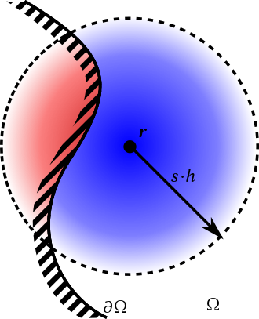
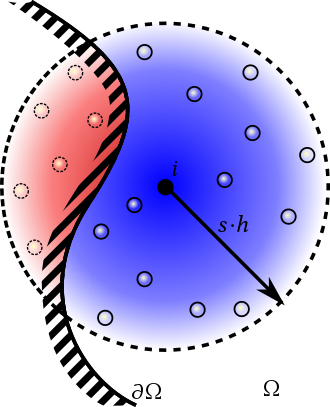

## 浮力与流体仿真
[English introduction](readme.md)


## 前言

项目需要实现一个浮力系统，因此做出了一些调研。不过，我不是专业学习流体力学的，如有错漏，还请指出。

一般来说，浮力有两种实现方法。
- 使用刚体模拟流体的位置，计算刚体与流体相交的部分，计算出浮力，应用在刚体上，如 [https://youtu.be/iasDPyC0QOg](https://youtu.be/iasDPyC0QOg)
  - 这种方法实现简单，适合于大场景流体相对静止的情形，如海洋，湖泊
- 使用大量粒子模拟流体行为，当其他物体与流体粒子碰撞时，物理引擎即可完成浮力计算。如 [https://www.youtube.com/watch?v=tzc0Iq9Zgt4](https://www.youtube.com/watch?v=tzc0Iq9Zgt4)
  - 这种方法实现复杂，需要解流体粒子的行为方程，比较耗费计算资源，适合于小场景流体运动的情形，如水杯、海浪。

这里主要讨论第二种方法。

## 常用方法
拉格朗日视角和欧拉视角是研究流体和可变形固体运行的两大常用方法。

拉格朗日视角基于粒子，将流体的数据，比如密度、质量、速度全部记录在一个具体的粒子上，粒子会随着模拟的推进而改变位置。
可以将每个粒子当成一个流体微团，拉格朗日方法模拟的是流体微团之间的相互作用得到的运动。
这是一种**对物质本身进行离散的 NS 方程求解方法**。
这种方法有很多好处，比如：理解起来直观，能量守恒。
但是拉格朗日视角下有不擅长的点，其中最大的就是粒子的邻居查找，这块查找邻居的时间一般是算法的瓶颈。

欧拉视角基于网格，将流体的数据记录在一组固定的空间点上面。
这个空间点上的属性的含义表示通过这个空间点的属性是多少，空间点的位置是不会随着模拟的推进而改变的。
这是一种对**空间进行离散的 NS 方程求解方法**。
这种做法的好处是整个场的数据自然离散到了空间点上，可以通过固定的点加上偏移得到周围空间点的数据。
但是欧拉视角在处理粒子运行时经常会出现能量耗散现象。

实践中，相比网格法，粒子法具有质量守恒，无边界区域等优势，更容易模拟复杂现象，如卷浪、水滴、流体和固体运动等。
因此其成为最广泛的流体模拟方法。
常见方法为 `Smoothed Particle Hydrodynamics` 与其变体 `Position Based Dynamics`。

### Smoothed Particle Hydrodynamics
SPH 是一种用来模拟连续介质动力学的离散方法，最初用于天体物理领域，近来在计算机图形学领域热度逐渐提高，常用来模拟流体运行。
由于其无网格的特性，SPH 在模拟复杂边界、扭曲拉伸、湍流上具有天然的优势。

SPH 的高层思想就是使用一堆随着模拟运动而更新位置的粒子去携带物理量，使用核函数来近似一个连续的场。
某一个位置的物理量的值等于周围粒子的加权平均，核函数用来决定权值。
变种非常多，比如 PBF、PCI-SPH、WCSPH 等。

定性的说。一般 SPH 算法的执行过程如下：

1. 对每个粒子计算它所在位置的密度与压强。
2. 对每个粒子计算它的压强梯度，进而得到它的 dv/dt （相当于求一个力）
3. 根据算出来的力更新速度，然后用更新过的速度更新位移。

SPH 算法在使用过程中一般最大瓶颈在于粒子的邻居搜索。
要精确地找到一个粒子的周围粒子，这个直接暴力的时间复杂度是 O(N^2)。
为了降低这个瓶颈带来的影响，一般会使用特殊的数据结构来存储粒子邻居。
比如将位置信息通过哈希算法投射到一个数组中，然后将粒子的位置信息离散为格子，做格子位置到数组的映射。
这样格子之间访问邻居只需要加上偏移量，一个粒子周围的粒子就等于他所在格子的所有粒子加上周围一圈格子的所有粒子。

SPH 算法需要比较小的迭代步长才能保持稳定，比较耗费计算量。

### Position Based Dynamics

PBD 针对流体的方法也称为 PBF (Position Based Fluid)，是 SPH 的变体之一。
SPH 方法通过迭代预测压力，通过压力变化达到粒子的不可压缩性。
而 PBD 则通过迭代更新位置，从而实现不可压缩性。

它具有这样的特征：

1. 直接基于位置而非受力情况来计算，计算的结果虽然并不是完全真实的物理模拟，但是可信度很高。
2. 性能更好，而且性能消耗的力度可控，可以根据实际应用中对真实性的需求强度来决定计算量。
3. 可以拥有很大的迭代步长，且有优秀的稳定性。
4. 使用约束模拟内力，对于布料、流体、刚体、绳索，都可以抽象为粒子间内力表现的不同形式，使用范围更为广泛。

因此 PBD 算法最适合的是游戏、电影等领域，不需要百分百完全真实，而是看起来像就可以了。

Nvidia 基于 PBD 实现了一个 [Flex](https://developer.nvidia.com/flex) 包。

## 实现
综上， SPH 与 PBD 都可以用来实现流体仿真。
虽然 PBD 相比 SPH 有许多的优势，但是由于它基于位置，计算过程中只接受外力，而不输出反作用力，因此并不适用于浮力这样的场景。

相反，SPH 是基于力实现的，因此我们可以在得到粒子的压强梯度之后，给粒子施加作用力，然后交由物理引擎去做剩余的计算，所以在实现可交互的流体场景时， SPH 的应用更为广泛。

### SPH 基础理论

SPH 流体模拟实际上是通过 SPH 方法求 [NS 方程](https://zh.wikipedia.org/wiki/%E7%BA%B3%E7%BB%B4-%E6%96%AF%E6%89%98%E5%85%8B%E6%96%AF%E6%96%B9%E7%A8%8B) 的数值解。
为了确保解的唯一性，需要有初值条件，它可能包括流体的初始形状（每个粒子的初始位置）、每个粒子的初始速度、位置的约束条件（空间边界）或速度的约束条件等。
因此 SPH 模拟流体即构成一个**初值-边界值混合问题（Mixed Initial-Boundary Value Problem）**。

SPH 使用近似增量核函数，空间

中某位置

处的任意场量

都可以通过

(1) 

计算得到。其中
 
是紧支域半径为
 
的光滑核函数。通过插值该积分式可以得到它的数值等价式

(2) 

其中 

为问题域中所有粒子，

为问题域中粒子

所处的位置，

为

处的场量。

为粒子

占据问题域的体积，体积与质量、质量密度有如下关系：

(3) 

其中 

为粒子质量，

为粒子的质量密度。通过把 (3) 代入 (2) 可以得到 SPH 方法的基本公式：

(4) 

该公式可以用于近似问题域中任何位置处的任何连续的场量。

### 邻居粒子搜索
SPH 求解过程的几个关键的步骤都需要考虑核半径内的邻居粒子贡献，也就必须对每个粒子都搜索它在整个问题域空间中的邻居粒子。
常用的邻居粒子搜索方法有全局搜索、空间均匀网格，空间多维树等。

使用空间均匀风格进行邻居搜索时，根据当前粒子的网格坐标可以得出它周围的 26 个网格坐标，对这 27 个网格分别求得值后，在 hash 表中查询网格中的粒子，判断是否为当前粒子的邻居。
也就是说，相比于全局搜索，空间均匀划分将搜索范围缩小到了自身及周围的 26 个网格，大大降低了搜索计算量。

在 CPU/GPU 两个不同的实现版本中，我使用了不同的网格划分方法。
主要是 GPU 中无法使用 `NativeMultiHashMap` 这样的数据结构，为了完成邻居粒子的查找，网格的 Hash 值应当是连续的。
```c#
// CPU version
public static int3 Quantize(float3 position, float size)
{
    return new int3(
        (int)math.floor(position.x / size),
        (int)math.floor(position.y / size),
        (int)math.floor(position.z / size)
    );
}

// FNV-1 hash https://en.wikipedia.org/wiki/Fowler%E2%80%93Noll%E2%80%93Vo_hash_function 
public static uint Hash(int3 p)
{
    uint hash = 2166136261u;

    for (int i = 0; i < 3; i++)
    {
        for (int j = 0; j < sizeof(int); j++)
        {
            byte b = (byte)(p[i] >> (j * 8));
            hash *= 16777619u;
            hash ^= b;
        }
    }

    return hash;
}
```
```hlsl
// GPU version
int3 Quantize(float3 position)
{
    position = (position - GridMin) / GridSize;
    int3 result = clamp(position, 0, GridLength - 1);
    return result;
}

uint Hash(int3 p)
{
    return p.x + p.y * GridLength.x + p.z * GridLength.x * GridLength.y;
}
```

#### 在 GPU 上实现邻居粒子搜索

To be completed.

### 密度求解
密度计算时考虑的粒子包括邻居粒子和自身。密度计算公式为：


密度使用光滑核：

=&space;h\end{cases}" />

### 压强求解

压强因为密度差异而产生。压强求解方法是区分 SPH 细分方法的一个重要特征。
目前的 SPH 方法大致可以分为两种：
- 一类是通过**状态方程（State Eq.）**求解压强的**微可压缩SPH（Weakly Compressible SPH）**
- 一类是求解**压力泊松方程（Pressure Poison Eq.）** 的不可压缩 SPH，它包括了 PCISPH、 IISPH、DFSPH 等诸多方法。

这里我采用的是 WCSPH 方法，因为其实现简单。

一个非常重要的点是，压强求解的目的是通过压强来施加不可压缩性，即通过压强对粒子之间施加排斥力，而不需要它为系统添加粒子间引力，因此压强应该是**正定**的。

WCSPH 使用**理想气体状态方程（Ideal Gas State Eq.）** 来求得压强：


这种方法通过刚度系统

来线性地根据粒子

的密度

与静止密度

的差距来施加压强。
可以看出粒子当前密度与静止密度的距离越大，施加的压强也就越大。

### 压力求解

得到粒子

处的压强后就可以求解粒子所受压力，压力来自于周围的粒子，因为各处压强差异而产生。
直观的理解是：流体总是由高压区流向低压区。计算公式为：


压力计算可以使用 Spiky 梯度核，它的梯度为：

=&space;h\end{cases}" />

其中

表示由粒子

指向邻居粒子

的方向向量。

### 粘性力求解

粘性力因流体微元之间的相对运动而产生，可以理解为粒子与粒子之间的动摩擦力。计算公式为：


粘性力计算使用粘性力光滑核，它的拉普拉斯算子为：

=&space;h\end{cases}" />

### 重力求解

重力计算根据重力加速度

来计算


### 时间积分

由于把整个 SPH 模拟问题在时间域上分裂成多个子问题，最终每个时间点的解需要在时间上做数值积分。
**显式积分（Explicit Integration）**方案简单有效，**隐式积分（Implicit Integration）**也有自己的优势，
而使用最广泛的是**半隐式积分（Semi-Implicit Integration）**。
图形学模拟的目标是力求以一种节省资源的方式进行稳定可靠的模拟，数值精确度往往是次要的。

**时间步长**的选择对模拟的稳定性和准确性至关重要，也关系到模拟效率。
较大的时间步长能够让模拟效率更高，同时也会引起数值精确度下降甚至不稳定。
较小的时间步长能免提高数值精确度，但会牺牲模拟效率。
图形学模拟需要在维持小时间步长来保证模拟稳定准确的情况下，尽可能选择更大的时间步长来提高模拟效率。

这里为了方便计算浮力，我直接交给了 Unity 的物理引擎来实现。

### 边界处理

因为边界处缺少流体粒子，导致密度计算偏小，压强偏小，边界的粒子都挤在一起。
实际上，边界处粒子的场量计算被边界截断成了两部分。



一个简单的方法就是在边界处填充上不会动的流体粒子。在进行流体粒子的场量计算时，将边界粒子也考虑在内。



## Roadmap

- [x] 根据流体与边界的形状生成流体粒子
- [x] CPU 版本
  - [x] 划分网格
  - [x] 计算粒子的密度与压强
  - [x] 计算粒子的受力
  - [x] 应用粒子受力
- [x] GPU 版本
  - [x] 划分网格
  - [x] 计算粒子的密度与压强
  - [x] 计算粒子的受力
  - [x] 应用粒子受力
  - [ ] 计算流体纹理，使粒子渲染成液体
- [ ] 使用体素方法为任意形状生成流体粒子

## 参考文献
- [Unity ECS Job System SPH](https://github.com/leonardo-montes/Unity-ECS-Job-System-SPH)
- [how to implement a fluid simulation on the cpu with unity ecs job system](https://medium.com/@leomontes_60748/how-to-implement-a-fluid-simulation-on-the-cpu-with-unity-ecs-job-system-bf90a0f2724f)
- [gentle introduction to fluid simulation for programmers and technical artists](https://shahriyarshahrabi.medium.com/gentle-introduction-to-fluid-simulation-for-programmers-and-technical-artists-7c0045c40bac)
- [SPH流体模拟基础](https://zhuanlan.zhihu.com/p/363054480)
- [2014_EG_SPH_STAR.pdf](https://cg.informatik.uni-freiburg.de/publications/2014_EG_SPH_STAR.pdf)
- [Implementing Bitonic Merge Sort in Vulkan Compute](https://poniesandlight.co.uk/reflect/bitonic_merge_sort/)
